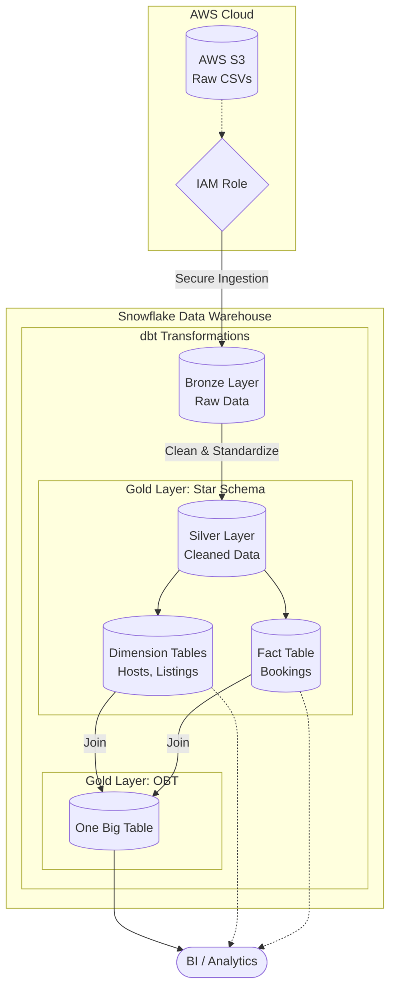

# Airbnb Data Pipeline

A production-style data engineering project that extracts raw Airbnb data from AWS S3 into Snowflake, utilizing dbt to transform the data using a Medallion architecture (Bronze, Silver, Gold), featuring both a Star Schema and a One Big Table (OBT) design.

## Overview

This repository demonstrates an end-to-end ELT (Extract, Load, Transform) workflow. Raw CSV files containing Airbnb bookings, hosts, and listings are staged in an AWS S3 bucket. Access is secured via AWS IAM roles, allowing Snowflake to securely ingest the data. From there, dbt handles the transformations, moving data through Bronze, Silver, and Gold layers, ultimately culminating in business-ready dimensional models and a denormalized One Big Table optimized for downstream BI and analytics.

## Data Architecture

1. **Storage & Ingestion (AWS S3 & IAM):** Raw source files are uploaded to an S3 bucket. IAM rules are configured to establish a secure integration between S3 and Snowflake.
2. **Data Warehouse (Snowflake):** Acts as the central compute and storage engine, integrated with dbt via the `dbt-snowflake` adapter.
3. **Transformation (dbt):** - **Bronze Layer:** Raw data ingestion and basic view creation.
   - **Silver Layer:** Data cleaning, standardization, type casting, and deduplication.
   - **Gold Layer (Star Schema):** The data is structured into Fact tables (e.g., `fact_bookings`) and Dimension tables (e.g., `dim_hosts`, `dim_listings`) optimized for relational integrity.
   - **Gold Layer (One Big Table):** The Star Schema is pre-joined into a highly denormalized, robust table (`obt_airbnb`) to maximize query performance for BI dashboards.
4. **Data Quality:** Enforced throughout the pipeline using dbt tests (uniqueness, non-null, referential integrity).



## Key Features

- **Cloud-Native Integration:** Secure data handoff from AWS S3 to Snowflake using IAM configurations.
- **Medallion Architecture:** Clear separation of raw, cleaned, and business-level data schemas.
- **Hybrid Gold Layer:** Utilizes both a Star Schema for structured dimensional modeling and a One Big Table (OBT) for high-performance dashboarding.
- **Automated Data Quality Checks:** Built-in dbt tests to prevent bad data from reaching the Gold layer.
- **Modular Project Structure:** Organized into models, macros, snapshots, and tests for maintainability.

## Tech Stack

- **Cloud Storage:** AWS S3, AWS IAM
- **Data Warehouse:** Snowflake
- **Transformation & Testing:** dbt Core, dbt-snowflake
- **Language:** Python, SQL

---

## Setup & Installation

### Prerequisites

- Python 3.11 or later
- An active Snowflake account and credentials
- An AWS account with S3 and IAM access
- Git

### Local Environment Setup

1. Clone the repository and navigate to the project directory:
```bash
git clone <repository-url>
cd airbnb_data_pipeline_project
```

2. Create and activate a virtual environment:
```powershell
python -m venv .venv
.\.venv\Scripts\Activate.ps1
```

3. Install dependencies:
```powershell
pip install dbt-core>=1.11.10 dbt-snowflake>=1.11.5
```

## Configuration

This project requires a `profiles.yml` file to connect dbt to your Snowflake environment. Configure this in `airbnb_data_pipeline_project/profiles.yml` or globally in `~/.dbt/profiles.yml`.

Example configuration:
```yaml
airbnb_data_pipeline_project:
  outputs:
    dev:
      type: snowflake
      account: <account_locator>
      user: <username>
      password: <password>
      role: <role>
      warehouse: <warehouse>
      database: <database>
      schema: <schema>
      threads: 4
  target: dev
```
> **Note:** Never commit actual passwords or sensitive credentials to source control.

## Usage

Ensure your virtual environment is activated, then run the following dbt commands from inside the `airbnb_data_pipeline_project` directory:

### 1. Check your connection
```bash
dbt debug
```

### 2. Run the models
This will build the Bronze, Silver, and Gold layers in Snowflake:
```bash
dbt run
```

### 3. Test data quality
Run the configured data tests against your built models:
```bash
dbt test
```

## Project Structure

- `dbt_project.yml` — Primary dbt configuration
- `models/` — SQL files for Bronze, Silver, and Gold (OBT) layers
- `macros/` — Reusable dbt macros
- `snapshots/` — Historical snapshot definitions
- `tests/` — Custom data quality tests
- `source data/` — Sample raw CSV files for reference